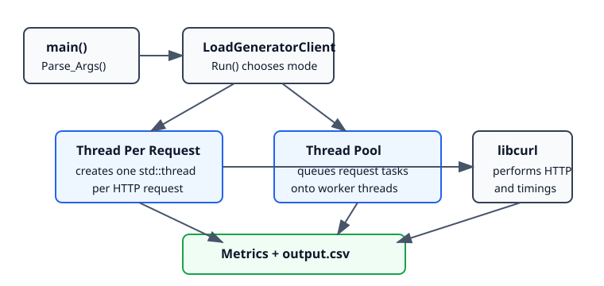
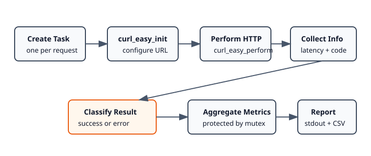

# HTTP-LoadGenerator

HTTP-LoadGenerator is a small C++ command-line load testing tool. It sends many HTTP requests to a target URL using libcurl, runs those requests either with one thread per request or with a fixed-size thread pool, then reports latency, throughput, success/error rates, and response-code breakdowns.

The repository also includes a simple threaded Python HTTP server for local testing.

## Features

- Sends a configurable number of HTTP requests to a URL.
- Supports two execution modes:
  - thread per request
  - fixed-size thread pool
- Uses libcurl for HTTP request execution and timing information.
- Reports metrics to stdout.
- Optionally appends metrics to a CSV file.
- Includes a local threaded HTTP server on `localhost:8000` for smoke testing.

## Requirements

- C++ compiler with C++11 thread support
- libcurl development files
- `curl-config`
- Python 3, only needed for the included local test server

On Ubuntu/Debian-like systems, the libcurl dependency is usually:

```bash
sudo apt install g++ libcurl4-openssl-dev
```

## Build

```bash
bash compile.sh
```

This produces:

```text
./http-loadgen
```

## Usage

Thread per request mode:

```bash
./http-loadgen <url> <request-count>
```

Thread pool mode:

```bash
./http-loadgen -p <pool-size> <url> <request-count>
```

Save results to CSV:

```bash
./http-loadgen -o <csv-file> <url> <request-count>
./http-loadgen -p <pool-size> -o <csv-file> <url> <request-count>
```

Arguments:

- `<url>`: target HTTP URL, such as `http://localhost:8000/`
- `<request-count>`: total number of requests to send
- `<pool-size>`: number of worker threads used in thread-pool mode
- `<csv-file>`: file path where metrics should be appended when `-o` is used

The final positional argument is the number of requests, not the number of threads. In thread-pool mode, `-p <pool-size>` controls the number of worker threads.

CSV output is disabled by default. Use `-o <csv-file>` when you want to save a run.

## Local Testing

Start the included Python server in one terminal:

```bash
python3 SimpleMultiThreadHTTPServer.py
```

It serves the current project directory at:

```text
http://localhost:8000/
```

Then run the load generator from another terminal:

```bash
bash compile.sh
./http-loadgen http://localhost:8000/ 100
```

Thread-pool example:

```bash
./http-loadgen -p 10 http://localhost:8000/ 100
```

Save a run to CSV:

```bash
./http-loadgen -o output.csv http://localhost:8000/ 100
./http-loadgen -p 10 -o output.csv http://localhost:8000/ 100
```

You can also request a specific file served by the Python server:

```bash
./http-loadgen http://localhost:8000/LICENSE 100
```

## Metrics

The tool prints one summary line after each run:

```text
Average-Response-Latency 0.002064 Average-First-Byte-Latency 0.002023 min/max-latency 0.001717/0.002338 requests-per-second 885.832 bytes-per-second 788391 success-rate 100% error-rate 0% status-code-breakdown 200:3 curl-error-breakdown
```

Metric meanings:

- `Average-Response-Latency`: average total request time from libcurl, in seconds
- `Average-First-Byte-Latency`: average time to first byte from libcurl, in seconds
- `min/max-latency`: fastest and slowest total request latency, in seconds
- `requests-per-second`: completed requests divided by total run time
- `bytes-per-second`: response payload bytes received divided by total run time
- `success-rate`: percent of completed requests with curl success and HTTP status `2xx` or `3xx`
- `error-rate`: percent of completed requests counted as failures
- `status-code-breakdown`: HTTP response codes and counts, such as `200:100`
- `curl-error-breakdown`: libcurl failures and counts, such as `Could not connect to server:5`

Small local runs can show very high requests-per-second because `localhost` requests may complete in only a few milliseconds. Use a larger request count for steadier throughput numbers.

## CSV Output

CSV output is opt-in. To append a run to a CSV file, pass `-o <csv-file>`:

```bash
./http-loadgen -o output.csv http://localhost:8000/ 100
```

Columns:

```text
Average-Response-Latency,Average-First-Byte-Latency,min-latency,max-latency,requests-per-second,bytes-per-second,success-rate,error-rate,success-count,error-count,status-code-breakdown,curl-error-breakdown
```

## Architecture

At a high level, `main` parses command-line arguments, creates a `LoadGeneratorClient`, and calls `Run()`. The client chooses an execution mode, sends requests through libcurl, aggregates shared metrics under a mutex, then prints and saves the results.



Standalone SVG: [docs/diagrams/architecture.svg](docs/diagrams/architecture.svg)

## Request Flow

Each request follows the same path regardless of execution mode. The mode only changes how the request tasks are scheduled.



Standalone SVG: [docs/diagrams/request-flow.svg](docs/diagrams/request-flow.svg)

## Code Layout

- `LoadGeneratorClient.cpp` / `LoadGeneratorClient.hpp`: command-line parsing, execution mode selection, libcurl request handling, metric aggregation, stdout and CSV output
- `ThreadPool.cpp` / `ThreadPool.hpp`: fixed-size worker pool used by `-p <pool-size>`
- `SimpleMultiThreadHTTPServer.py`: local threaded Python HTTP server for testing
- `compile.sh`: simple build script for `http-loadgen`
- `output.csv`: generated metrics file

## Notes and Limitations

- The tool currently sends `GET` requests only.
- HTTPS depends on the libcurl build available on your system.
- Metrics are process-global static fields, so each process run should execute one load test.
- `requests-per-second` is a measured rate: `completed requests / total elapsed run time`. It can be much larger than `<request-count>` for very fast local tests.
